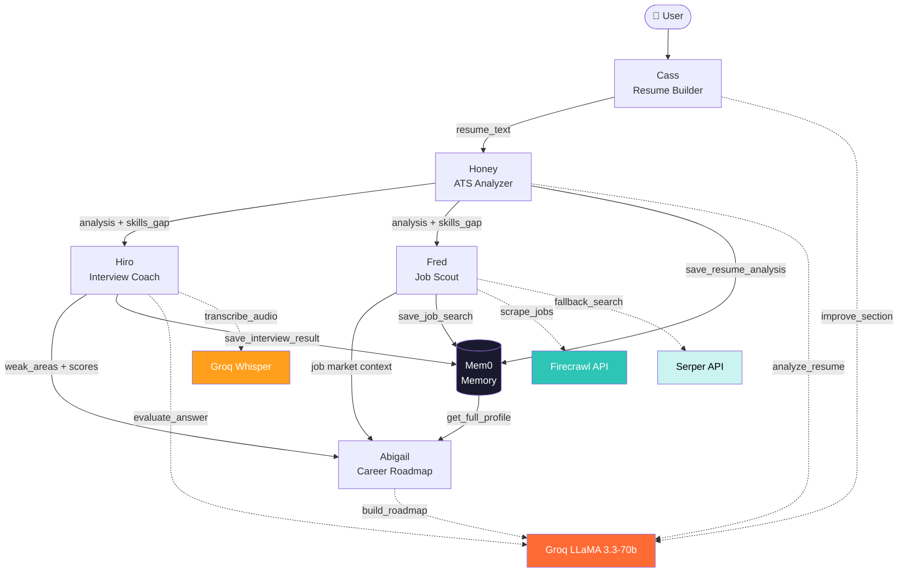

# 🚀 Baymax.app

> AI-powered multi-agent career copilot for students and early professionals.

Baymax.app combines classical AI systems, modern LLM orchestration, persistent memory, and real-time career tooling into a single intelligent platform that helps users improve resumes, prepare for interviews, discover jobs, and build personalized learning roadmaps.

Built for the **Women in AI Accelerator Build Challenge** and designed to solve accessibility gaps in career mentorship and placement support.

---

## ✨ Overview

Most career platforms solve isolated problems.

One tool improves resumes.  
Another gives interview questions.  
Another lists jobs.  
Another recommends courses.

Baymax.app unifies all of them into a collaborative multi-agent ecosystem where specialized AI agents work together through shared memory and orchestration.

The system blends:

- **Classical AI** for constraint reasoning and planning
- **LLMs** for personalization and natural interaction
- **Persistent memory** for long-term user context
- **Multi-agent specialization** for higher-quality outputs
- **Real-time APIs** for live career intelligence

---

## 🧠 Core Features

### 📄 Resume Intelligence
- ATS-style resume analysis
- Resume vs job description matching
- Bullet-point rewriting
- Section-level enhancement
- Resume generation assistance
- Persistent profile saving

### 🎤 AI Interview Coach
- Mock interview sessions
- Voice-to-text transcription
- Response evaluation and scoring
- Communication feedback
- Behavioral and technical interview practice

### 💼 Live Job Discovery
- Real-time job search
- Intelligent filtering
- Career-aligned recommendations
- Multi-source job retrieval with fallback systems

### 🛣️ Personalized Career Roadmaps
- 30 / 60 / 90-day growth plans
- Skill-gap analysis
- Certification recommendations
- AI mentor-style career guidance

### 🧠 Cross-Agent Memory
- Persistent user context using Mem0
- Shared memory between agents
- Session continuity across workflows

---

# 🏗️ System Architecture

## Multi-Agent Design

Baymax.app uses specialized AI agents instead of a single monolithic model.

| Agent | Responsibility |
|---|---|
| **Honey** | Resume analysis and enhancement |
| **Hiro** | Interview coaching and evaluation |
| **Fred** | Real-time job search |
| **Abigail** | Career planning and mentorship |
| **Mem0 Layer** | Persistent shared memory |

This architecture improves:
- response quality
- task specialization
- scalability
- maintainability
- contextual continuity


## Architecture Diagram



---

## ⚙️ Tech Stack

| Layer | Technology |
|---|---|
| **LLM Inference** | Groq LLaMA 3.3-70B |
| **Speech-to-Text** | Groq Whisper |
| **Memory** | Mem0 |
| **Backend** | FastAPI, Python 3.11 |
| **Frontend** | React 18, TypeScript, Vite |
| **UI** | shadcn/ui |
| **PDF Processing** | PyMuPDF |
| **Job Search** | Firecrawl API, Serper API |
| **Deployment** | DigitalOcean + Vercel |

---

# 🧩 Classical AI + Modern AI Hybrid Design

Baymax.app intentionally combines symbolic AI techniques with modern generative AI systems.

Instead of relying purely on LLM outputs, the roadmap generation pipeline uses:

- **Constraint Satisfaction Problems (CSPs)**
- **AC-3 Arc Consistency**
- **Backtracking Search**

to enforce scheduling realism and dependency constraints.

The LLM layer then converts the validated plan into personalized human-readable guidance.

This hybrid architecture produces outputs that are:
- more reliable
- constraint-aware
- personalized
- explainable

---

# 🔌 API Endpoints

| Method | Endpoint | Purpose |
|---|---|---|
| GET | `/health` | Backend + API health |
| POST | `/extract-resume` | Extract text from PDF |
| POST | `/resume/analyze` | Resume ATS analysis |
| POST | `/resume/analyze/upload` | Resume upload analysis |
| POST | `/resume/improve` | Rewrite bullet points |
| POST | `/resume/improve-section` | Improve full sections |
| POST | `/resume/generate-section` | Generate new section |
| POST | `/resume/save-profile` | Save user profile |
| GET | `/resume/profile/{user_id}` | Retrieve saved profile |
| POST | `/interview/start` | Start interview |
| POST | `/interview/reply` | Evaluate answer |
| POST | `/interview/transcribe` | Audio transcription |
| POST | `/interview/save-result` | Save interview metrics |
| POST | `/jobs` | Search live jobs |
| POST | `/roadmap` | Generate roadmap |
| POST | `/roadmap/certifications` | Recommend certifications |
| POST | `/roadmap/chat` | AI career mentorship |

---

# 📁 Project Structure

```bash
baymax.app/
│
├── backend/
│   ├── agents/
│   │   ├── resume_agent.py
│   │   ├── interview_agent.py
│   │   ├── job_search_agent.py
│   │   ├── career_planner_agent.py
│   │   └── memory_agent.py
│   │
│   ├── tools/
│   │   ├── pdf_tool.py
│   │   └── search_tool.py
│   │
│   ├── api.py
│   ├── config.py
│   └── requirements.txt
│
├── frontend/
│   ├── src/
│   │   ├── components/
│   │   ├── hooks/
│   │   ├── lib/
│   │   └── pages/
│
├── .env.example
├── render.yaml
├── start.sh
└── README.md
```

---

# 🚀 Quick Start

## 1. Clone Repository

```bash
git clone https://github.com/Aiza166/baymax.app.git
cd baymax.app
```

---

## 2. Configure Environment Variables

Create a `.env` file:

```env
GROQ_API_KEY=
SERPER_API_KEY=
FIRECRAWL_API_KEY=
MEM0_API_KEY=
```

---

# 🖥️ Backend Setup

```bash
cd backend

pip install -r requirements.txt

uvicorn api:app --reload
```

Backend runs on:

```bash
http://localhost:8000
```

---

# 🌐 Frontend Setup

```bash
cd frontend

npm install

npm run dev
```

Frontend runs on:

```bash
http://localhost:8080
```

---

# 🎯 Design Philosophy

Baymax.app was built around a simple idea:

> Career guidance should not be limited to students with elite networks, expensive coaching, or privileged access.

The platform is designed to make:
- mentorship
- interview preparation
- resume optimization
- career planning
- job discovery

more accessible through intelligent AI systems.

---

# 🔮 Future Improvements

Planned roadmap features include:

- LinkedIn profile analysis
- Recruiter dashboards
- Resume version tracking
- Interview analytics dashboard
- AI networking assistant
- Team collaboration support
- Fine-tuned domain-specific agents
- RAG-powered career knowledge base

---

## 🎬 The Demo

A successful end-to-end run looks like this:

1. **Resume Builder tab** — User uploads their existing PDF resume. Baymax parses it into structured fields (name, experience, education, skills). User clicks ✨ AI Improve on their work experience bullets → Groq rewrites them with stronger action verbs and metrics.

2. **ATS Analyzer tab** — User pastes a job description (e.g., "Software Engineer at Arbisoft"). Baymax returns: **Overall: 78/100, ATS: 85, Match: 71**, highlights missing keywords like "Django, REST APIs, CI/CD", and provides 5 rewritten bullet points.

3. **Interview Coach tab** — Baymax opens a voice-enabled 8-question mock interview tailored to "Software Engineer at a Pakistani startup." User speaks their answer → Whisper transcribes it → LLaMA evaluates it with a score and improvement feedback in real-time.

4. **Job Scout tab** — After the interview, Baymax searches Rozee.pk / LinkedIn for "Software Engineer in Karachi" and returns 6 live job cards with match percentages.

5. **Career Roadmap tab** — Abigail synthesizes all prior data into a 90-day plan: "Week 1-2: Django REST Framework (free on YouTube), Week 3-4: Docker fundamentals (KodeKloud free tier)..." User chats with the Rahul persona: "How do I get a scholarship for the AWS cert?" → Rahul generates a financial aid email template.

---

## 🛡️ Responsible AI Considerations

### What Could Go Wrong?

| Risk | Likelihood | Impact |
|------|-----------|--------|
| Hallucinated job listings | Medium | High — user applies to fake jobs |
| Overconfident resume scores | Medium | Medium — builds false confidence |
| Biased interview feedback | Low | High — discriminatory language |
| User data exposure via Mem0 | Low | High — PII in cloud memory |
| Prompt injection via resume text | Low | Medium — jailbreak via PDF |

### Guardrails In Place

1. **Input Validation** — All endpoints validate minimum text lengths, file types (PDF only), and reject empty fields with 400 errors.

2. **Rate Limiting** — FastAPI `slowapi` middleware limits sensitive endpoints to 10 req/min per IP to prevent abuse.

3. **Output Parsing with Fallbacks** — All LLM responses are parsed with explicit fallback structures. If the model returns malformed JSON, safe defaults are returned rather than crashing.

4. **No PII Logging** — Resume text and user answers are never written to server logs. Only aggregate metadata (scores, job titles) is persisted.

5. **Job Listing Disclaimer** — The Job Scout tab explicitly labels results as "AI-curated suggestions" and links to the original source URL. Users are advised to verify listings directly.

6. **Mem0 Isolation** — Each user gets a unique `user_id`. No cross-user data leakage is possible at the API level.

7. **Explainability** — Every score (ATS, Match, Overall) includes textual reasoning. The interview feedback explains *why* an answer scored what it did.

8. **User Control** — Users can reset their profile, switch resume sources, and overwrite all AI-generated content manually.

---

---

# 📜 License

MIT License

---

# ❤️ Acknowledgements

Built with care for:
- Women in AI Accelerator Build Challenge
- AI Mustaqbil 2.0
- Students navigating career uncertainty
- Early professionals seeking accessible guidance

---

# 👩‍💻 Author

## Aiza Gazyani

Computer Science undergraduate passionate about:
- AI systems
- multi-agent architectures
- human-centered technology
- accessible career tooling

GitHub: https://github.com/Aiza166
